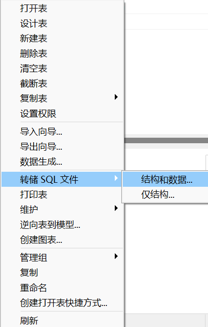

# 从Access到sql文件

需求：Access“导出”sql脚本，要求包含建表语句与数据项内容。

## 我能导出什么呢？

Access可以导出多种格式的内容，包括Excel系列（xlsx、xls、xlsb）、文本文件系列（txt、csv、tab、asc）、pdf或xps、HTML（htm、html）、Access系列（accdb、mdb、adp、mda、accda、mde、accde、ade）、链接到Word文档（rtf）、导出到SharePoint、ODBC数据库、xml、dBASE文件等。

<div style={{textAlign: 'center'}}>

<font color="grey"><br />Access选择“外部数据”中“其他”类别来查看导出选项</font>
</div>

显然，其中并没有直接能够生成`.sql`的方法，笔者使用的是`Navicat 16 for MySQL`工具开发sql，故于此方向进行努力。MySQL以及Navicat的安装教程详见 **[MySQL & NaviCat 安装及配置教程（Windows）【安装】](https://blog.csdn.net/qq_41918107/article/details/140439212)**，本篇文章不再赘述。

## 安装工具

需要一个工具： **[MySQL-Connector-ODBC](https://dev.mysql.com/downloads/)**

ODBC英文全称为：**Open Database Connectivity**。它用于在不同的操作系统和数据库管理系统之间进行数据访问的标准化接口。它提供了一组函数和API，使得应用程序可以通过统一的方式访问不同类型的数据源，如关系型数据库、文件、电子表格等。实现了数据与程序的解耦。在使用ODBC时，首先需要安装相应的ODBC驱动程序，然后通过ODBC API连接到特定的数据源。ODBC驱动程序负责将应用程序的请求翻译为特定数据库系统的通信协议，并将结果返回给应用程序。

<div style={{textAlign: 'center'}}>

<font color="grey"><br />选择ODBC</font>
</div>

可以自选安装/免安装版本。

<div style={{textAlign: 'center'}}>

<font color="grey"><br />自选ODBC安装/免安装版本</font>
</div>


## ODBC设置

安装完成后，检索栏搜索找到ODBC Data Sources（ODBC 数据源）打开。

<div style={{textAlign: 'center'}}>

<font color="grey"><br />ODBC数据源</font>
</div>

首先在驱动程序中查询是否有MYSQL的驱动程序，如果没有，可能MYSQL安装不正确，如遇不正确情况请移步至 **[MySQL & NaviCat 安装及配置教程（Windows）【安装】](https://blog.csdn.net/qq_41918107/article/details/140439212)**

<div style={{textAlign: 'center'}}>

<font color="grey"><br />在驱动程序中找到MySQL ODBC相关的对应驱动</font>
</div>

<div style={{textAlign: 'center'}}>

<font color="grey"><br />在用户DSN中添加数据源</font>
</div>

<div style={{textAlign: 'center'}}>

<font color="grey"><br />unicode创建新数据源</font>
</div>

<div style={{textAlign: 'center'}}>

<font color="grey"><br />填写新数据源信息</font>
</div>

```js title="Data Source Configuration"
Data Source Name:连接名称，可自定义
Description:可不填
TCP/IP Server:端口，笔者是本地localhost
Port:3306默认
User:设置的sql用户名
Password:设置的sql密码
Database:选择的数据库名
```

填写完毕之后需要通过Test来测试是否成功，失败请检查用户名与密码的正确性。

<div style={{textAlign: 'center'}}>

<font color="grey"><br />选择数据库名</font>
</div>

点击OK就可以看到我们新添加的数据源了。
<div style={{textAlign: 'center'}}>

<font color="grey"><br />新添加的数据源，本处为ImportMySql</font>
</div>

## Access通过ODBC传输数据表

<div style={{textAlign: 'center'}}>

<font color="grey"><br />选择ODBC导出</font>
</div>

<div style={{textAlign: 'center'}}>

<font color="grey"><br />选择ODBC导出名称</font>
</div>

<div style={{textAlign: 'center'}}>

<font color="grey"><br />选择数据源</font>
</div>

选择“机器数据源”并选中数据源名称（本处为ImportMySql）。
## Navicat“导出”sql

打开 **`Navicat 16 for MySQL`**，打开已经连接的数据库（本处名为mysql），若未连接数据库请先进行连接。右键单击数据库名并重载表内容，相当于刷新数据表。

<div style={{textAlign: 'center'}}>

<font color="grey"><br />重载数据表</font>
</div>

<div style={{textAlign: 'center'}}>

<font color="grey"><br />可以看到刷新后出现的数据表名</font>
</div>

右键单击数据表名，在“转储SQL文件”中选择“结构和数据”。

<div style={{textAlign: 'center'}}>

<font color="grey"><br />重载数据表</font>
</div>

<div style={{textAlign: 'center'}}>

<font color="grey"><br />完成SQL文件导出</font>
</div>

<div style={{textAlign: 'center'}}>

<font color="grey"><br />查看SQL文件内容</font>
</div>

这样就可以从Access直通sql脚本了，以便于之后做处理或者做数据转移。不过现在使用Access的情况不是很多，笔者有时使用该工具做excel巨量数据的复杂处理，算是比较方便的。